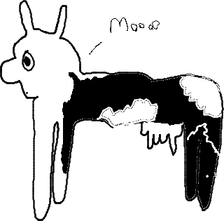

<p align="center">
  <a href="" rel="noopener">
 </a>
</p>

<h3 align="center">Project Title</h3>

<div align="center">

  [](/LICENSE)

</div>

---

<p align="center"> Few lines describing your project.
    <br> 
</p>

## 📝 Table of Contents
- [About](#about)
- [Getting Started](#getting_started)
- [Usage](#usage)
- [Built Using](#built_using)
- [TODO](../TODO.md)
- [Contributing](../CONTRIBUTING.md)
- [Authors](#authors)
- [Acknowledgments](#acknowledgement)

## 🧐 About <a name = "about"></a>
 The list with coolest cow quotes 

## 🏁 Getting Started <a name = "getting_started"></a>

To get a local copy up and running follow these simple steps.

```
# Clones this repository
git clone

# Change directory
cd cowqcode

# Build the project
make

# Have fun! 
./bin/cowqcode
```

### Prerequisites

To get started using this project you need to have the following installed on your machine:
```
- g++
- make
```

### Installing

To install cowqcode on your machine run the following command:
```
sudo make install
```

Make sure it worked:

```
cowqcode
```

## 🎈 Usage <a name="usage"></a>

```bash
# Enter the following command and enter your quote
cowqcode
```


## ✍️ Authors <a name = "authors"></a>
- [@boessee](https://github.com/boessee) - Idea & Initial work

## 🎉 Acknowledgements <a name = "acknowledgement"></a>

